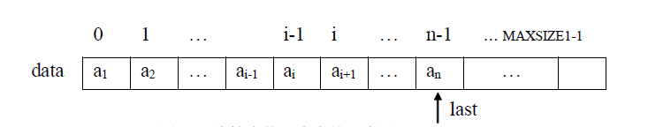
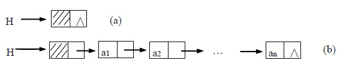

## 线性表

线性表(linear_list)是最常用且最简单的一种数据结构。

一个线性表是n个数据元素的有限序列，它有两种表示形式：顺序表示跟链式表示。

#### **线性表的顺序表示和实现**

线性表的顺序表示指的是用一组**地址连续**的存储单元依次存储线性表的数据元素，这种数据结构称之为**顺序表**。



下面顺序表的一种实现

```c
#include <stdio.h>
#include <malloc.h>
#include <stdbool.h>
#define OK 1
#define ERROR 0
#define OVERFLOW -1
#define LIST_INIT_SIZE 100     //线性表存储空间的初始分配量
#define LISTINCREMENT 10       //线性表存储空间的分配增量

typedef char ElemType;
typedef struct
{
    ElemType *elem;     //存储空间的基址
    int length;         //当前长度
    int listsize;       //当前分配的存储容量（以sizeof(ElemType)为单位）
}SqList;

//初始化顺序表
int InitList(SqList &L)
{
    L.elem=(ElemType *)malloc(LIST_INIT_SIZE*sizeof(ElemType));
    if(!L.elem)  return OVERFLOW;  //存储分配失败
    L.length=0;                    //空表长度为0
    L.listsize=LIST_INIT_SIZE;     //初始存储容量
    return OK;
}

//销毁顺序表
void DestroyList(SqList &L)
{
    free(L.elem);
}

//在顺序表L中第i个位置之前插入新的元素e
int ListInsert(SqList &L,int i,ElemType e)
{
    //i的合法值为1≤i≤L.length+1
    if(i<1||i>L.length+1)  return ERROR;
    //当前存储空间已满，重新分配空间
    if(L.length>=L.listsize)
    {
        ElemType *newbase=NULL;
        newbase  = (ElemType*)realloc(L.elem(L.listsize+LISTINCREMENT)*sizeof(ElemType));
        if(!newbase)  return OVERFLOW;
        L.elem=newbase;
        L.listsize+=LISTINCREMENT;
    }
    //p为插入位置
    ElemType *p=&(L.elem[i-1]);
    //插入位置及之后的元素右移  q为最后一个元素的位置
    for(ElemType *q=(L.elem+L.length-1);q>=p;--q)  *(q+1)=*q;
    *p=e;              //插入e
    ++L.length;         //表长加1
}

//在顺序表L中删除第i个元素，并用e返回其值
int ListDelete(SqList &L,int i,ElemType &e)
{
    //i的合法值为1≤i≤L.length
    if(i<1||i>L.length)  return ERROR;
    ElemType *p=&(L.elem[i-1]);    //p为被删除位置元素的位置
    e=*p;                          //将删除元素的值赋给e
    ElemType *q=L.elem+L.length-1; //q为表尾元素的位置
    for(;p<=q;++p)    *p=*(p+1);
    --L.length;
    return OK;
}


//判断顺序表是否为空表
bool ListEmpty(SqList &L)
{
    return (L.length==0);
}

//求顺序表的长度
int ListLength(SqList &L)
{
    return (L.length);
}

//输出顺序表
void DispList(SqList &L)
{
    if(ListEmpty(L))  return;
    for(int i=0;i<L.length;++i)
        printf("%c",L.elem[i]);
    printf("\n");
}

//获取顺序表中索引位置的元素值
bool GetElem(SqList &L,int i,ElemType &e)
{
    if(i<1||i>L.length)  return false;
    e=L.elem[i-1];
    return true;
}

//按元素值查找
int LocateElem(SqList &L,ElemType e)
{
    int i=0;
    //查找元素e
    while(i<L.length&&L.elem[i++]!=e);
    //未找到
    if(i>L.length)  return -1;
    return i;
}
```

#### **线性表的链式表示和实现**

线性表的链式存储结构的特点是用一组任意的存储单元存储线性表的数据元素（这组存储单元可以是连续的，也可以是不连续的）。

为了表示元素之间的逻辑（先后）关系，对于任一数据元素，除了存储元素本身的信息之外，还需存储一个指示其直接后继的信息（即直接后继的存储位置）。

每个数据元素包含两个域：其中存储数据元素信息的域称为**数据域**，存储直接后继存储位置的域称为**指针域**。



######  **单链表**（带头节点）

```c
#include <stdio.h>
#include <malloc.h>
typedef char ElemType;
//定义单链表节点类型
typedef struct LNode
{
    ElemType data;
    struct LNode *next;
}LinkList;

//初始化
void InitList(LinkList *&L)
{
    //创建头节点
    L=(LinkList *)malloc(sizeof(LinkList));
    L->next=NULL;
}

//销毁单链表
void DestroyList(LinkList *&L)
{
    LNode *p=L;
    LNode *q=p->next;
    while(q!=NULL)
    {
        free(p);
        p=q;
        q=q->next;
    }
    free(p);
}

//判断是否为空表
bool ListEmpty(LinkList *L)
{
    return  (L->next==NULL);
}

//求单链表的长度
int ListLength(LinkList *L)
{
    int i=0;
    LNode *p=L;
    while(p->next!=NULL)
    {
        i++;
        p=p->next;
    }
    return i;
}

//输出单链表
void DispList(LinkList *L)
{
    LNode *p=L->next;
    while(p!=NULL)
    {
        printf("%c",p->data);
        p=p->next;
    }
    printf("\n");
}

//按逻辑索引值找数据元素值  该值通过e返回
bool GetElem(LinkList *L,int i,ElemType &e)
{
    int j=0;
    LNode *p=L;
    while(j<i&&p!=NULL)
    {
        j++;
        p=p->next;
    }
    if(p==NULL)
        return false;
    e=p->data;
    return true;
}

//按元素值查找逻辑索引值
int LocateElem(LinkList *L,ElemType e)
{
    LNode *p=L->next;
    int i=1;
    while(p!=NULL&&p->data!=e)
    {
        i++;
        p=p->next;
    }
    if(p==NULL)
        return 0;
    return i;
}

//插入数据元素
bool ListInsert(LinkList *&L,int i,ElemType e)
{
    int j=0;
    LNode *p=L;
    //找到索引为i-1的节点
    while(j<i-1&&p!=NULL)
    {
        j++;
        p=p->next;
    }
    if(p==NULL)
        return false;
    LNode *node=(LNode *)malloc(sizeof(LNode));
    node->data=e;
    node->next=p->next;
    p->next=node;
    return true;
}

//删除数据元素
bool ListDelete(LinkList *&L,int i,ElemType &e)
{
    int j=0;
    LNode *p=L;
    //找到索引为i-1的节点
    while(j<i-1&&p!=NULL)
    {
        j++;
        p=p->next;
    }
    //未找到第i-1个节点
    if(p==NULL)
        return false;
    //不存在第i个节点
    if(p->next==NULL)
        return false;
    //记录要删除的节点
    LNode *q=p->next;
    e=q->data;
    p->next=q->next;
    free(q);
    return true;
}
```

**双链表**中的元素比单链表的元素多出一个指针域，这个指针域指向该元素的前驱。

双链表的实现跟单链表类似，只是多出了对前驱指针域的操作。


###### 双链表

```c
#include <stdio.h>
#define maxSize 7
typedef struct {
    char data;
    int cur;
}component;
//将结构体数组中所有分量链接到备用链表中
void reserveArr(component *array);
//初始化静态链表
int initArr(component *array);
//向链表中插入数据，body表示链表的头结点在数组中的位置，add表示插入元素的位置，a表示要插入的数据
void insertArr(component * array,int body,int add,char a);
//删除链表中含有字符a的结点
void deletArr(component * array,int body,char a);
//查找存储有字符elem的结点在数组的位置
int selectElem(component * array,int body,char elem);
//将链表中的字符oldElem改为newElem
void amendElem(component * array,int body,char oldElem,char newElem);
//输出函数
void displayArr(component * array,int body);
//从备用链表中摘除空闲节点的实现函数
int mallocArr(component * array);
//将摘除下来的节点链接到备用链表上
void freeArr(component * array,int k);

int main() {
    component array[maxSize];
    int body=initArr(array);
    printf("静态链表为：\n");
    displayArr(array, body);
  
    printf("在第3的位置上插入结点‘e’:\n");
    insertArr(array, body, 3,'e');
    displayArr(array, body);
  
    printf("删除数据域为‘a’的结点:\n");
    deletArr(array, body, 'a');
    displayArr(array, body);
  
    printf("查找数据域为‘e’的结点的位置:\n");
    int selectAdd=selectElem(array,body ,'e');
    printf("%d\n",selectAdd);
    printf("将结点数据域为‘e’改为‘h’:\n");
    amendElem(array, body, 'e', 'h');
    displayArr(array, body);
    return 0;
}
//创建备用链表
void reserveArr(component *array){
    for (int i=0; i<maxSize; i++) {
        array[i].cur=i+1;//将每个数组分量链接到一起
        array[i].data=' ';
    }
    array[maxSize-1].cur=0;//链表最后一个结点的游标值为0
}

//初始化静态链表
int initArr(component *array){
    reserveArr(array);
    int body=mallocArr(array);
    //声明一个变量，把它当指针使，指向链表的最后的一个结点，因为链表为空，所以和头结点重合
    int tempBody=body;
    for (int i=1; i<5; i++) {
        int j=mallocArr(array);//从备用链表中拿出空闲的分量
        array[tempBody].cur=j;//将申请的空线分量链接在链表的最后一个结点后面
        array[j].data='a'+i-1;//给新申请的分量的数据域初始化
        tempBody=j;//将指向链表最后一个结点的指针后移
    }
    array[tempBody].cur=0;//新的链表最后一个结点的指针设置为0
    return body;
}

void insertArr(component * array,int body,int add,char a){
    int tempBody=body;
    for (int i=1; i<add; i++) {
        tempBody=array[tempBody].cur;
    }
    int insert=mallocArr(array);
    array[insert].cur=array[tempBody].cur;
    array[insert].data=a;
    array[tempBody].cur=insert;
  
}

void deletArr(component * array,int body,char a){
    int tempBody=body;
    //找到被删除结点的位置
    while (array[tempBody].data!=a) {
        tempBody=array[tempBody].cur;
        //当tempBody为0时，表示链表遍历结束，说明链表中没有存储该数据的结点
        if (tempBody==0) {
            printf("链表中没有此数据");
            return;
        }
    }
    //运行到此，证明有该结点
    int del=tempBody;
    tempBody=body;
    //找到该结点的上一个结点，做删除操作
    while (array[tempBody].cur!=del) {
        tempBody=array[tempBody].cur;
    }
    //将被删除结点的游标直接给被删除结点的上一个结点
    array[tempBody].cur=array[del].cur;
  
    freeArr(array, del);
}

int selectElem(component * array,int body,char elem){
    int tempBody=body;
    //当游标值为0时，表示链表结束
    while (array[tempBody].cur!=0) {
        if (array[tempBody].data==elem) {
            return tempBody;
        }
        tempBody=array[tempBody].cur;
    }
    return -1;//返回-1，表示在链表中没有找到该元素
}

void amendElem(component * array,int body,char oldElem,char newElem){
    int add=selectElem(array, body, oldElem);
    if (add==-1) {
        printf("无更改元素");
        return;
    }
    array[add].data=newElem;
}

void displayArr(component * array,int body){
    int tempBody=body;//tempBody准备做遍历使用
    while (array[tempBody].cur) {
        printf("%c,%d ",array[tempBody].data,array[tempBody].cur);
        tempBody=array[tempBody].cur;
    }
    printf("%c,%d\n",array[tempBody].data,array[tempBody].cur);

}

//提取分配空间
int mallocArr(component * array){
    //若备用链表非空，则返回分配的结点下标，否则返回0（当分配最后一个结点时，该结点的游标值为0）
    int i=array[0].cur;
    if (array[0].cur) {
        array[0].cur=array[i].cur;
    }
    return i;
}
//将摘除下来的节点链接到备用链表上
void freeArr(component * array,int k){
    array[k].cur=array[0].cur;
    array[0].cur=k;
}
```

###### 

**循环链表**是另一种形式的链式存储的结构，它的特点是表中最后一个节点的指针域指向头节点，整个链表形成一个环。

下图是一个循环单链表


###### 循环链表

 下面是循环单链表的实现，跟单链表不同的是要处理尾节点的指针域 

```c
#include <stdio.h>
#include <malloc.h>
typedef char ElemType;
typedef struct LNode
{
    ElemType data;
    struct LNode *next;
}LinkList;

//初始化循环链表
void InitList(LinkList *&L)
{
    //创建头结点
    L=(LinkList *)malloc(sizeof(LinkList));
    L->next=L;
}

//销毁循环链表
void DestoryList(LinkList *&L)
{
    LNode *p=L;
    LNode *q=L->next;
    while(q!=L)
    {
        free(p);
        p=q;
        q=q->next;
    }
    free(p);
}

//判断是否为空表
bool ListEmpty(LinkList *L)
{
    return (L->next==L);
}

//求表长
int ListLength(LinkList *L)
{
    int i=0;
    LNode *p=L->next;
    while(p!=L)
    {
        i++;
        p=p->next;
    }
    return i;
}

//输出线性表
void DispList(LinkList *L)
{
    LNode *p=L->next;
    while(p!=L)
    {
        printf("%c",p->data);
        p=p->next;
    }
    printf("\n");
}

//找指定位置的元素
bool GetElem(LinkList *L,int i,ElemType &e)
{
    LNode *p=L->next;
    int j=0;
    while(j<i-1&&p!=L)
    {
        j++;
        p=p->next;
    }
    if(p==L)
        return false;
    e=p->data;
    return true;
}

//查找元素位置
int LocateElem(LinkList *L,ElemType e)
{
    LNode *p=L->next;
    int i=1;
    while(p!=L&&p->data!=e)
    {
        i++;
        p=p->next;
    }
    if(p==L)
        return 0;
    return i;
}

//插入元素
bool ListInsert(LinkList *&L,int i,ElemType e)
{
    LNode *p=L;
    int j=0;
    //找到索引为i-1的节点
    while(p->next!=L&&j<i-1)
    {
        j++;
        p=p->next;
    }
    if(j!=i-1)
        return false;
    LNode *node=(LNode *)malloc(sizeof(LNode));
    node->data=e;
    //*p是最后一个元素
    if(p->next==L)
    {
        p->next=node;
        node->next=L;
    }
    else
    {
        node->next=p->next;
        p->next=node;
    }
    return true;
}

//删除元素
bool ListDelete(LinkList *&L,int i,ElemType &e)
{
    LNode *p=L;
    int j=0;
    //找到索引为i-1的节点
    while(p->next!=L&&j<i-1)
    {
        j++;
        p=p->next;
    }
    if(j!=i-1)
        return false;
    //如果第i-1个节点是最后一个节点
    if(p->next==L)
        return false;
    LNode *q=p->next;
    e=q->data;
    //如果第i个节点是最后一个节点
    if(q->next==L)
    {
        p->next=L;
        free(q);
    }
    else
    {
        p->next=q->next;
        free(q);
    }
    return true;
}
```

 下图是一个循环双链表，它的实现可以参照循环单链表跟普通双链表 


## 栈

栈(stack)是限定尽在表尾进行插入或删除操作的线性表。与线性表类似，栈也有两种存储表示方式。

下面是**顺序栈的实现**。

#### 顺序栈

```c
#include <stdio.h>
#include <malloc.h>
#define MaxSize 100
typedef char ElemType;
//定义顺序栈
typedef struct
{
    ElemType data[MaxSize];
    //栈顶指针
    int top;
}SqStack;

//初始化栈
void InitStack(SqStack *&s)
{
    s=(SqStack *)malloc(sizeof(SqStack));
    s->top=-1;
}

//销毁栈
void DestroyStack(SqStack *s)
{
    free(s);
}

//判断栈空
bool StackEmpty(SqStack *s)
{
    return (s->top==-1);
}

//进栈
bool Push(SqStack *&s,ElemType e)
{
    //栈满的时候
    if(s->top==MaxSize-1)
        return false;
    s->data[++s->top]=e;
    return true;
}

//出栈
bool Pop(SqStack *&s,ElemType &e)
{
    //栈空的时候
    if(s->top==-1)
        return false;
     e=s->data[s->top--];
     return true;
}

//取栈顶元素
bool GetTop(SqStack *&s,ElemType &e)
{
    //栈空的时候
    if(s->top==-1)
        return false;
     e=s->data[s->top];
     return true;
}
```

## 队列

与栈相反，队列是一种先进先出的线性表。它只允许在表的一端进行插入，而在另一端删除元素。

和线性表类似，队列也可以有两种存储表示。

用链表表示的队列简称链队列。下面是**带头结点的单链队列**的实现 


#### 单链队列

```c
#include <stdio.h>
#include <malloc.h>

typedef char QElemType;
//单链队列节点
typedef struct QNode
{
    QElemType data;
    struct QNode *next;
}QNode,*QueuePtr;
//单链队列
typedef struct
{
    QueuePtr front;   //队头指针
    QueuePtr rear;    //队尾指针
}LinkQueue;

//初始化单链队列
void InitQueue(LinkQueue &Q)
{
    Q.front=Q.rear=(QueuePtr)malloc(sizeof(QNode));
    Q.front->next=NULL;
}

//销毁单链队列
void DestroyQueue(LinkQueue &Q)
{
    while(Q.front)
    {
        Q.rear=Q.front->next;
        free(Q.front);
        Q.front=Q.rear;
    }
}

//入队列
void EnQueue(LinkQueue &Q,QElemType e)
{
    QueuePtr p=(QueuePtr)malloc(sizeof(QNode));
    p->data=e;
    p->next=NULL;
    Q.rear->next=p;
    Q.rear=p;
}

//出队列
bool DeQueue(LinkQueue &Q,QElemType &e)
{
    if(Q.front==Q.rear)
        return false;
    QueuePtr p=Q.front->next;
    e=p->data;
    Q.front->next=p->next;
    //如果队列只有一个元素
    if(p==Q.rear)
        Q.front=Q.rear;
    free(p);
}
```

 队列的顺序表示一般实现为**循环队列**。下面是循环队列的实现 

#### 循环队列


 因为`Q.front=Q.rear`不能区分队列是空还是满，所以下面采用少用一个元素空间来解决这个问题。 

```c
#include <stdio.h>
#include <malloc.h>
#define MAXQSIZE 100   //最大队列长度

typedef char QElemType;
//定义循环队列
typedef struct
{
    QElemType *base;   //
    int front;         //头指针，若队列非空，指向队列头元素
    int rear;          //尾指针，若队列非空，指向队列尾元素的下一个位置
}SqQueue;

//初始化
void InitQueue(SqQueue &Q)
{
    Q.base=(QElemType *)malloc(MAXQSIZE*sizeof(QElemType));
    Q.front=Q.rear=0;
}

//获取队列的长度
int QueueLength(SqQueue Q)
{
    return (Q.rear-Q.front+MAXQSIZE)%MAXQSIZE;
}

//入队列
bool EnQueue(SqQueue &Q,QElemType e)
{
    //判断队列是否已经满了
    if((Q.rear+1)%MAXQSIZE==Q.front)
        return false;
    Q.base[Q.rear]=e;
    Q.rear=(Q.rear+1)%MAXQSIZE;
    return true;
}

//出队列
bool DeQueue(SqQueue &Q,QElemType &e)
{
    //判断队列是否为空
    if(Q.rear==Q.front)
        return false;
    e=Q.base[Q.front];
    Q.front=(Q.front+1)%MAXQSIZE;
    return true;
}
```

## 二叉树

#### 二叉树的遍历

###### 1.二叉树结点的定义 

```c
typedef char ElemType;
typedef struct node
{
    ElemType data;
    struct node *lchild;
    struct node *rchild;
}BiTree;
```

###### 2.建树

```c
void CreateBiTree(BiTree *&T)
{
    char ch;
    //按先序次序输入二叉树中节点的值（一个字符），空格字符表示空树
    scanf("%c",&ch);
    if(ch==' ')
        T=NULL;
    else
    {
        T=(BiTree *)malloc(sizeof(BiTree));
        T->data=ch;               //生成根结点
        CreateBiTree(T->lchild);  //构造左子树
        CreateBiTree(T->rchild);  //构造右子树
    }
}
```

 例如如果要建一棵如下图的二叉树，需要输入ABC××D××E×F××(×表示空格) 


######  3.先序遍历递归算法 （中序、后序遍历递归算法类似） 

```c
void PreOrder(BiTree *T)
{
    if(T!=NULL)
    {
        printf("%c",T->data);
        PreOrder(T->lchild);
        PreOrder(T->rchild);
    }
}
```

###### 4. 先序遍历非递归算法 

```c
void PreOrderTraverse(BiTree *T)
{
    stack<BiTree*> s;
    if(T==NULL)
    {
        printf("空树\n");
        return;
    }
    while(T||!s.empty())
    {
        //让根结点先进栈(用来还原)，然后一直向左边搜索
        while(T)
        {
            s.push(T);
            printf("%c",T->data);
            T=T->lchild;
        }
        //把最近的根结点还原，遍历其右子树
        T=s.top();
        s.pop();
        T=T->rchild;
    }
}
```

######  5.中序遍历非递归算法

跟先序遍历非递归算法唯一的不同是访问结点的时间不一样 

```c
void InOrderTraverse(BiTree *T)
{
    stack<BiTree *> s;
    if(T==NULL)
    {
        printf("空树\n");
        return;
    }
    while(T||!s.empty())
    {
        //让根结点先进栈(用来还原)，然后一直向左边搜索
        while(T)
        {
            s.push(T);
            T=T->lchild;
        }
        //把最近的根结点还原，遍历其右子树
        T=s.top();
        s.pop();
        //在出栈之后访问该结点
        printf("%c",T->data);
        T=T->rchild;
    }
}
```

###### 6.后序遍历非递归算法 

 添加一个`pre`指针来判断右子树是否被访问 

```c
void PostOrderTraverse(BiTree *T)
{
    stack<BiTree *> s;
    BiTree *pre=NULL;     //指向前一个被访问的节点
    if(T==NULL)
    {
        printf("空树\n");
        return;
    }
    while(T||!s.empty())
    {
        //一直向左走直到为空
        while(T)
        {
            s.push(T);
            T=T->lchild;
        }
        T=s.top();
        //当前节点的右孩子如果为空或者已经被访问过，则访问当前节点
        if(T->rchild==NULL||T->rchild==pre)
        {
            printf("%c",T->data);
            pre=T;
            s.pop();
            T=NULL;
        }
        //否则访问右孩子
        else
            T=T->rchild;
    }
}
```

