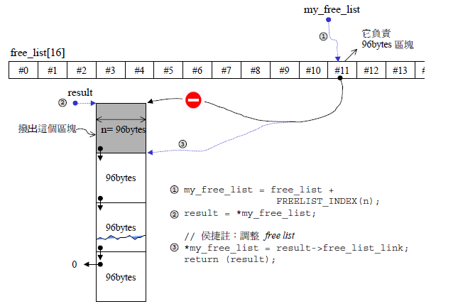
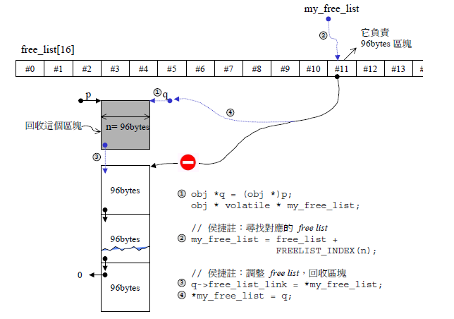
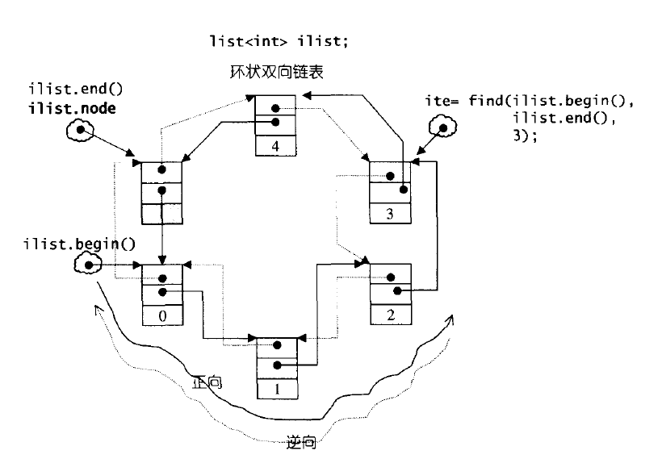

## 空间配置器

#### **前言**

在STL中，容器的定义中都带一个模板参数，如vector

```c++
template <class T, class Alloc = alloc>
class vector {...}
```

其中第二个参数就是该容器使用的空间配置器，其中缺省使用STL已经实现的空间配置器(alloc)，

该配置器使用malloc/free等为vector分配内存。

#### **缺省的空间配置器**

alloc定义了两级的空间配置器，第一级是对malloc/free简单的封装。

而为了解决内存碎片的问题，跟进行内存管理，alloc实现的第二级的空间配置器。

第二级空间配置器在分配大块内存(大于128bytes)时，会直接调用第一级空间配置器，

而分配小于128bytes的内存时，则使用内存池跟free_list进行内存分配/管理。

 

#### **第一级空间配置器**

基本实现如下(跟SGI STL可能有点出入，主要是提取核心的内容)

```c++
class base_alloc 
{
public:
    // 只是对malloc/free的简单封装
    static void* allocate(size_t n)
    {
        void* res = malloc(n);
        if (0 == res) res = oom_malloc(n);
        return res;
    }

    static void* reallocate(void* p, size_t new_sz)
    {
        void* res = realloc(p, new_sz);
        if (0 == res) res = oom_realloc(p, new_sz);
        return res;
    }

    static void deallocate(void* p)
    {
        free(p);
    }
    // 用来设置内存不足时的处理函数 该函数参数跟返回值都是一个函数指针
    // 一般会抛出异常/尝试回收内存
    static void(*set_handler(void(*f)()))()
    {
        void(*old)() = _oom_handler;
        _oom_handler = f;
        return old;
    }
private:
    // 用来处理内存不足的情况
    static void* oom_malloc(size_t n)
    {
        void(*my_handler)();
        void* res;

        for (;;)
        {
            my_handler = _oom_handler;
            if (0 == my_handler) { return NULL; }
            (*my_handler)();
            if (res = malloc(n)) return res;
        }
    }
    // 用来处理内存不足的情况
    static void* oom_realloc(void* p, size_t n)
    {
        void(*my_handler)();
        void* res;

        for (;;)
        {
            my_handler = _oom_handler;
            if (0 == my_handler) { return NULL; }
            (*my_handler)();
            if (res = reallocate(p, n)) return res;
        }
    }
    // 由用户设置，在内存不足的时候进行处理，由上面两个函数调用
    static void(*_oom_handler)();
};

// 处理函数默认为0
void(*base_alloc::_oom_handler)() = 0;
```

 它可以设定一个处理内存不足的时候的处理函数(跟set_new_handler类似)。 

#### **第二级空间配置器**

该配置器维护一个free_list，这是一个指针数组。

在分配内存的时候，补足8bytes的倍数，free_list数组中每个指针分别管理分配大小为8、16、24、32...bytes的内存。

下图表示从二级空间配置器中分配内存时是如何维护free_list的(建议参考下面源码阅读)。

开始所有指针都为0，没有可分配的区块时(就是free_list[i]==0)会从内存池中分配内存(默认分配20个区块)插入到free_list[i]中。

然后改变free_list[i]的指向，指向下一个区块(free_list_link指向下一个区块，如果没有则为0)。



下图表示二级空间配置器回收内存时是如何维护free_list结构的。

回收的时候只是将区块插入到free_list[i]的开头，这块内存用于下次分配的时候使用。



 该配置器实现如下(同样提取核心的部分)： 

```c++
enum { _ALIGN = 8 };    // 对齐
enum { _MAX_BYTES = 128 }; // 区块大小上限
enum { _NFREELISTS = _MAX_BYTES / _ALIGN }; // free-list个数

class default_alloc {
private:
    // 将bytes上调到8的倍数
    static size_t ROUND_UP(size_t bytes)
    {
        return (bytes + _ALIGN - 1) & ~(_ALIGN - 1);
    }
private:
    union obj {
        union obj* free_list_link;
        char client_data[1];
    };
private:
    // 16个free-lists 各自管理分别为8,16,24...的小额区块
    static obj* free_list[_NFREELISTS];
    // 根据区块大小，决定使用第n号free-list
    static size_t FREELIST_INDEX(size_t bytes)
    {
        return (bytes + _ALIGN - 1) / _ALIGN - 1;
    }
    // 分配内存，返回一个大小为n的区块，可能将大小为n的其他区块加入到free_list
    static void* refill(size_t n)
    {
        // 默认分配20个区块
        int nobjs = 20;
        char* chunk = chunk_alloc(n, nobjs);
        obj** my_free_list;
        obj* result, *current_obj, *next_obj;

        // 如果只分配了一个区块，直接返回
        if (1 == nobjs) return chunk;
        // 否则将其他区块插入到free list
        my_free_list = free_list + FREELIST_INDEX(n);
        result = (obj*)chunk;
        // 第一个区块返回 后面的区块插入到free list
        *my_free_list = next_obj = (obj*)(chunk + n);
        for (int i = 1;; ++i)
        {
            current_obj = next_obj;
            next_obj = (obj*)((char*)next_obj + n);
            // 最后一个next的free_list_link为0
            if (nobjs - 1 == i)
            {
                current_obj->free_list_link = 0;
                break;
            }
            current_obj->free_list_link = next_obj;
        }
        return result;
    }
    // 分配内存
    // 在内存池容量足够时，只调整start_free跟end_free指针
    // 在内存池容量不足时，调用malloc分配内存(2 * size * nobjs +  ROUND_UP(heap_size >> 4)，每次调整heap_size += 本次分配内存的大小)
    static char* chunk_alloc(size_t size, int& nobjs);

    static char* start_free; //内存池的起始位置
    static char* end_free;     //内存池的结束位置
    static size_t heap_size;         //分配内存时的附加量
public:
    static void* allocate(size_t n)
    {
        obj** my_free_list;
        obj* result;
        // 大于128就调用第一级空间配置器
        if (n > (size_t)_MAX_BYTES)
            return base_alloc::allocate(n);

        // 寻找适当的free-list
        my_free_list = free_list + FREELIST_INDEX(n);
        result = *my_free_list;
        // 没有可用的free list
        if (result == 0)
            return refill(ROUND_UP(n));

        // 调整free list 移除free list
        *my_free_list = result->free_list_link;
        return result;
    }
    static void deallocate(void* p, size_t n)
    {
        obj* q = (obj*)p;
        obj** my_free_list;

        // 大于128就调用第一级空间配置器
        if (n > (size_t)_MAX_BYTES)
        {
            base_alloc::deallocate(p);
            return;
        }

        // 寻找对应的free list
        my_free_list = free_list + FREELIST_INDEX(n);
        // 调整free list 回收区块(将区块插入到my_free_list)
        q->free_list_link = *my_free_list;
        *my_free_list = q;
    }
    static void reallocate(void* p, size_t old_sz, size_t new_sz);
};

char* default_alloc::start_free = 0;
char* default_alloc::end_free = 0;
size_t default_alloc::heap_size = 0;
default_alloc::obj* default_alloc::free_list[_NFREELISTS] = { 0, 0, 0, 0, 0, 0, 0, 0, 0, 0, 0, 0, 0, 0, 0, 0 };
```

## 迭代器

在STL中，容器跟算法是分开设计的，算法是通过迭代器来对容器进行操作的。

在算法运用迭代器的时候，可能会用到其相应的型别，例如返回值为容器中元素的型别，又或者说根据迭代器的类型来选择更好的算法等等。

为了实现这一点，还有为了兼容内置型别的迭代器(vector迭代器直接使用原生pointer)，STL使用了traits技法，用于提取迭代器的特性(相应的型别)。

 1.首先在iterator中typedef相应的型别 

```c++
// 这是迭代器的基类 所有迭代器必须定义这5种型别
template<class Category, class T, class Distance = ptrdiff_t,
class Pointer = T*, class Reference = T&>
struct iterator {
    typedef Category iterator_category;
    typedef T value_type;
    typedef Distance difference_type;
    typedef Pointer pointer;
    typedef Reference reference;
};
```

 2.定义萃取器iter_traits 

```c++
// 以迭代器为模板参数，用于萃取相应的型别
template <class Iterator>
struct iter_traits {
    typedef typename Iterator::iterator_category iterator_category;
    typedef typename Iterator::value_type value_type;
    typedef typename Iterator::difference_type difference_type;
    typedef typename Iterator::pointer pointer;
    typedef typename Iterator::reference reference;
};
```

3.定义相应的偏特化版本(这就是为什么要使用iter_traits封装多一层)，因为内置型别的迭代器并不是class，不能定义相应的型别。 

```c++
// 原生指针的偏特化版
template <class T>
struct iter_traits<T*> 
{
    typedef typename random_access_iter_tag iterator_category;
    typedef typename T value_type;
    typedef typename ptrdiff_t difference_type;
    typedef typename T* pointer;
    typedef typename T& reference;
};

// 原生const的偏特化版
template <class T>
struct iter_traits<const T*> 
{
    typedef typename random_access_iter_tag iterator_category;
    typedef typename T value_type;
    typedef typename ptrdiff_t difference_type;
    typedef typename const T* pointer;
    typedef typename const T& reference;
};
```

 4.5种迭代器类型，只是一个标志，用于根据萃取出来的iterator_category来选择相应的算法。 

```c++
struct input_iter_tag {};
struct output_iter_tag {};
struct forward_iter_tag : public input_iter_tag {};
struct bidirectional_iter_tag : public forward_iter_tag {};
struct random_access_iter_tag  : public bidirectional_iter_tag {};
```

 下面是distance()的实现，展示了怎么使用traits萃取相应的型别。 

```c++
// input迭代器只支持operator++
template<class InputIterator>
inline typename iter_traits<InputIterator>::difference_type
__distance(InputIterator first, InputIterator last, input_iter_tag)
{
    iter_traits<InputIterator>::difference_type n = 0;
    while (first != last)
    {
        first++;
        n++;
    }
    return n;
}

// random access迭代器支持迭代器之间的加减法
template<class RandomAccessIterator>
inline typename iter_traits<RandomAccessIterator>::difference_type
__distance(RandomAccessIterator first, RandomAccessIterator last, random_access_iter_tag)
{
    return last - first;
}

// 根据迭代器的iterator_category来调用适合的版本
template<class Iterator>
inline typename iter_traits<Iterator>::difference_type
distance(Iterator first, Iterator last)
{
    return __distance(first, last, iter_traits<Iterator>::iterator_category());
}
```

 STL的__type_traits也是使用traits技法，它可以萃取一个class是否有不重要的构造函数、是否为POD类型等等。 

```c++
// __type_traits也是运用traits技术
struct __true_type {};
struct __false_type {};

template <class type>
struct __type_traits {
    // 默认为false  可以实现自己的偏特化版本
    // 内置类型的偏特化版本定义在stl_config.h中  都是__true_type
    typedef __false_type    has_trivial_default_constructor;
    typedef __false_type    has_trivial_copy_constructor;
    typedef __false_type    has_trivial_assignment_operator;
    typedef __false_type    has_trivial_destructor;
    typedef __false_type    is_POD_type;
};
```

自定义的类型可以定义相应的偏特化版本，例如定义is_POD_type为__true_type，STL会在元素析构的时候只进行内存回收，而不调用析构函数以用来提高效率。

 

内存基本处理工具

STL定义了五个全局函数，作用于未初始化空间上，同样的它们也是使用了traits技法。

1.construct()跟destroy()，它们定义在stl_construct.h中

2.uninitialized_copy()、uninitialized_fill()、uninitialized_fill_n()，它们定义在stl_uninitialized中

## vector

在SGI STL中，vector使用的是连续的内存空间，迭代器使用普通指针来实现。

因为使用的是连续的内存空间，在vector容量不足的时候会直接分配一块新的内存，把原来的元素copy进去，回收原来的内存空间。

因此在vector扩容的时候，原来的所有迭代器都会失效。

 

vector的实现基本都是围绕这start、end、end_of_storage三个指针，首先先看看vector的基本定义

```c++
template <class T, class Alloc = alloc>
class vector {
public:
    // 基本型别定义
    typedef T value_type;
    typedef value_type* pointer;
    typedef value_type* iterator;
    typedef value_type& reference;
    typedef size_t size_type;
    typedef ptrdiff_t difference_type;
protected:
    // 空间配置器 只是对Alloc的进一步封装
    typedef simple_alloc<value_type, Alloc> data_allocator;
    // 关键的几个迭代器
    iterator start;
    iterator finish;
    iterator end_of_storage;
public:
    vector() : start(0), finish(0), end_of_storage(0) {}
    // 回收内存
    void deallocate() {
        if (start) data_allocator::deallocate(start, end_of_storage -    start);
    }
    ~vector() {
        destroy(start, finish); // 对[start, finish)的元素调用相应的析构函数(如果是POD类型则什么都不做)
        deallocate();
    }
    // 提供简单的接口
    iterator begin() { return start; }
    iterator end() { return finish; }
    size_type size() const { return size_type(end() - begin()); }
    size_type max_size() const { return size_type(-1) / sizeof(T); }
    size_type capacity() const { return size_type(end_of_storage - begin()); }
    bool empty() const { return begin() == end(); }
    reference operator[](size_type n) { return *(begin() + n); }
};
```

因为vector实现比较简单，所以就不一一的列出全部成员函数的实现了，主要还是关注其关于插入元素的实现。

先看看比较常用的push_back的实现。

```c++
void push_back(const T& x) 
{
    if (finish != end_of_storage) 
    {
      construct(finish, x); // 调用placement new构造对象
      ++finish;
    }
    else // 容量不足的情况
      insert_aux(end(), x);
  }
```

 insert_aux用于在position中插入元素，该函数还可以处理容量不足的情况 

```c++
template <class T, class Alloc>
void vector<T, Alloc>::insert_aux(iterator position, const T& x) {
    // 有剩余空间
    if (finish != end_of_storage) {
        construct(finish, *(finish - 1));
        ++finish;
        T x_copy = x;
        copy_backward(position, finish - 2, finish - 1);
        *position = x_copy;
    }
    // 容量不足
    else {
        const size_type old_size = size();
        // 分配原来的两倍大小
        const size_type len = old_size != 0 ? 2 * old_size : 1;
        // 重新分配空间
        iterator new_start = data_allocator::allocate(len);
        iterator new_finish = new_start;
        try 
        {
            // 将原来的内容复制到新的vector
            new_finish = uninitialized_copy(start, position, new_start);
            construct(new_finish, x);
            ++new_finish;
            new_finish = uninitialized_copy(position, finish, new_finish);
        }
        catch(...) 
        {
            destroy(new_start, new_finish);
            data_allocator::deallocate(new_start, len);
            throw;
        }
        // 析构并释放原来的vector
        destroy(begin(), end());
        deallocate();
        // 调整三个迭代器
        start = new_start;
        finish = new_finish;
        end_of_storage = new_start + len;
  }
}
```

 普通的insert函数也是通过insert_aux实现的 

```c++
iterator insert(iterator position, const T& x) {
    size_type n = position - begin();
    if (finish != end_of_storage && position == end()) {
        construct(finish, x);
        ++finish;
    }
    else
        insert_aux(position, x);
    return begin() + n;
}
```

 对应的erase函数实现更加的简单 

```c++
iterator erase(iterator position) {
    if (position + 1 != end())
        copy(position + 1, finish, position);
    --finish;
    destroy(finish);
    return position;
}

iterator erase(iterator first, iterator last) {
    iterator i = copy(last, finish, first);
    destroy(i, finish);
    finish = finish - (last - first);
    return first;
}
```

## list

 SGI STL中list是使用环状双向链表实现的。它的结点结构定义如下： 

```c++
template <class T>
struct __list_node {
    typedef void* void_pointer;
    void_pointer next;
    void_pointer prev;
    T data;
};
```

 list定义了属于自己的迭代器，并重载了operator*(用于取结点的data成员)、operator+(用于取next结点)等等。 

```c++
template<class T, class Ref, class Ptr>
struct __list_iterator {
    // 定义相应型别
    typedef __list_iterator<T, T&, T*>             iterator;
    typedef __list_iterator<T, Ref, Ptr>           self;

    typedef bidirectional_iterator_tag iterator_category;
    typedef T value_type;
    typedef Ptr pointer;
    typedef Ref reference;
    typedef __list_node<T>* link_type;
    typedef size_t size_type;
    typedef ptrdiff_t difference_type;

    // 拥有一个指向对应结点的指针
    link_type node;

    // 构造函数
    __list_iterator() {}
    __list_iterator(link_type x) : node(x) {}
    __list_iterator(const iterator& x) : node(x.node) {}

    // 重载了iterator必须的操作符
    reference operator*() const { return (*node).data; }
    pointer operator->() const { return &(operator*()); }
    self& operator++() {
        node = (link_type)((*node).next);
        return *this;
    }
    self& operator--() {
        node = (link_type)((*node).prev);
        return *this;
    }
    // ...
};
```

list的定义比较简单，而且环状双向链表的操作并不用过多的考虑边界条件。

list创建的时候会创建一个空白的结点，并用其node成员指向它，下面是list的基本定义：

```c++
template <class T, class Alloc = alloc>
class list {
protected:
    typedef void* void_pointer;
    typedef __list_node<T> list_node;
    typedef simple_alloc<list_node, Alloc> list_node_allocator;
public:
    typedef T value_type;
    typedef value_type* pointer;
    typedef value_type& reference;
    typedef list_node* link_type;
    typedef size_t size_type;
    typedef ptrdiff_t difference_type;
public:
    // 定义迭代器类型
    typedef __list_iterator<T, T&, T*> iterator;
protected:
    link_type node;  // 空白结点  链表尾结点
    // ...
};
```

 下面是list的示意图 



 根据示意图我们很容易理解list的构造： 

```c++
template <class T, class Alloc = alloc>
class list {
public:
// ...
    // 可以从图中直观的看出来
    iterator begin() { return (link_type)((*node).next); }
    iterator end() { return node; }

    // 默认构造函数
    list() { empty_initialize(); }
protected:
    // 为结点分配内存
    link_type get_node() { return list_node_allocator::allocate(); }
    // 回收内存
    void put_node(link_type p) { list_node_allocator::deallocate(p); }
    // 构造node
    link_type create_node(const T& x) {
        link_type p = get_node();
        construct(&p->data, x);
        return p;
    }
    // 销毁node
    void destroy_node(link_type p) {
        destroy(&p->data);
        put_node(p);
    }
    // 初始化
    void empty_initialize() {
        node = get_node();
        node->next = node;
        node->prev = node;
    }
// ...
};
```

list成员函数的实现其实就是对环状双向链表的操作。

首先是insert、erase、transfer的实现，关于插入删除大部分都调用这三个函数，实际上就是改变结点pre跟next指针的指向。

```c++
iterator insert(iterator position, const T& x) {
    link_type tmp = create_node(x);
    // 改变四个指针的指向 实际就是双向链表元素的插入
    tmp->next = position.node;
    tmp->prev = position.node->prev;
    (link_type(position.node->prev))->next = tmp;
    position.node->prev = tmp;
    return tmp;
}

iterator erase(iterator position) {
    // 改变四个指针的指向 实际就是双向链表的元素删除
    link_type next_node = link_type(position.node->next);
    link_type prev_node = link_type(position.node->prev);
    prev_node->next = next_node;
    next_node->prev = prev_node;
    destroy_node(position.node);
    return iterator(next_node);
}

// 将[first, last)插入到position位置(可以是同一个链表)
void transfer(iterator position, iterator first, iterator last) {
    if (position != last) {
        // 实际上也是改变双向链表结点指针的指向 具体操作看下图
        (*(link_type((*last.node).prev))).next = position.node;
        (*(link_type((*first.node).prev))).next = last.node;
        (*(link_type((*position.node).prev))).next = first.node;
        link_type tmp = link_type((*position.node).prev);
        (*position.node).prev = (*last.node).prev;
        (*last.node).prev = (*first.node).prev;
        (*first.node).prev = tmp;
    }
}
```


 有了上面3个函数，list对外的接口实现就非常简单了 

```c++
void push_front(const T& x) { insert(begin(), x); }
void push_back(const T& x) { insert(end(), x); }
void pop_front() { erase(begin()); }
void pop_back() {
    iterator tmp = end();
    erase(--tmp);
}

// splice有很多重载版本
void splice(iterator position, list&, iterator first, iterator last) 
{
    if (first != last)
        transfer(position, first, last);
}

// merge函数实现跟归并排序中合并的操作类似
template <class T, class Alloc>
void list<T, Alloc>::merge(list<T, Alloc>& x) { ... }

// reserse函数每次都调用transfer将结点插入到begin()之前
template <class T, class Alloc>
void list<T, Alloc>::reverse() {
    if (node->next == node || link_type(node->next)->next == node) return;
    iterator first = begin();
    ++first;
    while (first != end()) {
        iterator old = first;
        ++first;
        transfer(begin(), old, first);
    }
}

// list必须使用自己的sort()成员函数 因为STL算法中的sort()只接受RamdonAccessIterator
// 该函数采用的是quick sort
template <class T, class Alloc>
void list<T, Alloc>::sort() { ... }
```

## deque

deque是一个双向开口的容器，在头尾两端进行元素的插入跟删除操作都有理想的时间复杂度。

deque使用的是分段连续线性空间，它维护一个指针数组(T** map)，其中每个指针指向一块连续线性空间。

(map左右两边一般留有剩余空间，用于前后插入元素，具体下面可以看到其实现)


 根据上图，可以了解到deque的迭代器的基本定义。 

```c++
template <class T, class Ref, class Ptr, size_t BufSiz>
struct __deque_iterator {
    // 基本型别的定义
    typedef __deque_iterator<T, T&, T*, BufSiz>             iterator;
    typedef random_access_iterator_tag iterator_category;
    typedef T value_type;
    typedef Ptr pointer;
    typedef Ref reference;
    typedef size_t size_type;
    typedef ptrdiff_t difference_type;
    typedef T** map_pointer;
    typedef __deque_iterator self;

    // 缓冲区的大小
    tatic size_t buffer_size() { ... }

    // 主要维护的三个指针
    T* cur;    // 指向当前元素
    T* first;   // 指向当前缓冲区的头
    T* last;   // 指向当前缓冲区的尾

    map_pointer node; // 指向当前缓冲区在map中的位置
    // ...
};
```

 deque的实现基本都是依赖于其迭代器的实现(主要是各种操作符的重载) 

```c++
// 用于跳到下一个缓冲区
void set_node(map_pointer new_node) {
    node = new_node;
    first = *new_node;
    last = first + difference_type(buffer_size());
}

reference operator*() const { return *cur; }
pointer operator->() const { return &(operator*()); }

self& operator++() {
    ++cur;
    if (cur == last) {  // 到达缓冲区尾端
        set_node(node + 1);
        cur = first;
    }
    return *this;
}

self& operator--() {
    if (cur == first) { // 已到达缓冲区头端
        set_node(node - 1);
        cur = last;
    }
    --cur;
    return *this;
}

// 迭代器之间的距离(相隔多少个元素)
difference_type operator-(const self& x) const {
    return difference_type(buffer_size()) * (node - x.node - 1) +
      (cur - first) + (x.last - x.cur);
}
```

该迭代器还重载了operator+=、operator+、operator-=、operator-(difference_type)等，

都是通过set_node()跟调整cur、first、last、node成员来实现。同时重载的operator[]使用operator+来进行随机存取。

```c++
self& operator+=(difference_type n) {
    difference_type offset = n + (cur - first);
    if (offset >= 0 && offset < difference_type(buffer_size()))
        cur += n;
    else {
        // 目标在不同的缓冲区
        difference_type node_offset =
        offset > 0 ? offset / difference_type(buffer_size())
                   : -difference_type((-offset - 1) / buffer_size()) - 1;
        // 跳到相应的缓冲区
        set_node(node + node_offset);
        // 调整cur指针
        cur = first + (offset - node_offset * difference_type(buffer_size()));
    }
    return *this;
}

// 下面的都直接或间接的调用operator+=
self operator+(difference_type n) const {
    self tmp = *this;
    return tmp += n;
}

self& operator-=(difference_type n) { return *this += -n; }

self operator-(difference_type n) const {
    self tmp = *this;
    return tmp -= n;
}

reference operator[](difference_type n) const { return *(*this + n); }
```

 有了__deque_iterator，deque的基本实现就比较简单了(主要维护start、finish这两个迭代器) 


 下面是deque的基本定义 

```c++
template <class T, class Alloc = alloc, size_t BufSiz = 0>
class deque {
public:
    typedef T value_type;
    typedef value_type* pointer;
    typedef size_t size_type;
    typedef pointer* map_pointer;
public:
    typedef __deque_iterator<T, T&, T*, BufSiz>  iterator;
protected:
    iterator start;    // 第一个节点
    iterator finish;   // 最后一个结点

    map_pointer map;
    size_type map_size;
public:
    iterator begin() { return start; }
    iterator end() { return finish; }

    reference operator[](size_type n) { return start[difference_type(n)]; } // 调用迭代器重载的operator[]

    // ...
}
```

 deque的constructor会调用create_map_and_nodes()来初始化map 

```c++
// 每次配置一个元素大小的配置器
typedef simple_alloc<value_type, Alloc> data_allocator;
// 每次配置一个指针大小的配置器
typedef simple_alloc<pointer, Alloc> map_allocator;

template <class T, class Alloc, size_t BufSize>
void deque<T, Alloc, BufSize>::create_map_and_nodes(size_type num_elements) {
    // 需要分配的结点数  如果为能整除 则多分配多一个结点
    size_type num_nodes = num_elements / buffer_size() + 1;

    // 分配结点内存 (前后预留一个 用于扩充)
    map_size = max(initial_map_size(), num_nodes + 2);
    map = map_allocator::allocate(map_size);

    // 将需要分配缓冲区的结点放在map的中间
    map_pointer nstart = map + (map_size - num_nodes) / 2;
    map_pointer nfinish = nstart + num_nodes - 1;

    map_pointer cur;
    // 为了简化 去掉了异常处理的代码
    for (cur = nstart; cur <= nfinish; ++cur)
        *cur = allocate_node(); // 为每个结点分配缓冲区
    }

    // 设置start、finish指针
    start.set_node(nstart);
    finish.set_node(nfinish);
    start.cur = start.first;
    finish.cur = finish.first + num_elements % buffer_size();
}
```

 下面就剩下插入跟删除元素的实现了，首先看看关于push_front()的操作的实现。 

```c++
void push_front(const value_type& t) {
    if (start.cur != start.first) {    // 第一缓冲区还有容量
        construct(start.cur - 1, t);
        --start.cur;
    }
    else
        push_front_aux(t);
  }

// 如果第一缓冲区容量不足会调用这个函数来配置新的缓冲区
template <class T, class Alloc, size_t BufSize>
void deque<T, Alloc, BufSize>::push_front_aux(const value_type& t) {
    value_type t_copy = t;
    reserve_map_at_front();   // 可能导致map的重新整治
    *(start.node - 1) = allocate_node();
    start.set_node(start.node - 1);
    start.cur = start.last - 1;
    construct(start.cur, t_copy);
}

// 根据map前面为分配的结点数量来判断是否需要重新整治
void reserve_map_at_front (size_type nodes_to_add = 1) {
    if (nodes_to_add > start.node - map)
        reallocate_map(nodes_to_add, true);
}
```

上面留下的reallocate_map函数执行如下功能:

1.如果map中空闲指针足够多，则将已分配的结点移到map的中间。

2.否则重新分配一个map，将旧的map释放，把已分配的结点移到new_map的中间。

然后调整start跟finish迭代器。

 

然后是pop_front()的实现

```c++
void pop_front() {
    if (start.cur != start.last - 1) {
        destroy(start.cur);
        ++start.cur;
    }
    else
        pop_front_aux();
}

// 当前缓冲区只剩一个元素
template <class T, class Alloc, size_t BufSize>
void deque<T, Alloc, BufSize>::pop_front_aux() {
    destroy(start.cur);
    deallocate_node(start.first);  // 释放该缓冲区
    start.set_node(start.node + 1);
    start.cur = start.first;
}
```

而push_back()跟pop_back()的实现跟上面的大同小异。

最后看看erase()跟insert()的实现

```c++
iterator erase(iterator pos) {
    iterator next = pos;
    ++next;
    difference_type index = pos - start; // 迭代器的operator-
    if (index < (size() >> 1)) { // 如果清除点之前的元素比较少
        // 将清除点之前的所有元素后移一位  然后删除第一个元素
        copy_backward(start, pos, next);  // 利用了迭代器的operator--
        pop_front();
    }
    else { // 如果清除点之后的元素比较少
        // 将清除点之后的所有元素前移一位  然后删除最后一个元素
        copy(next, finish, pos);  // 利用了迭代器的operator++
        pop_back();
    }
    return start + index;
}
```

```c++
iterator insert(iterator position, const value_type& x) {
    if (position.cur == start.cur) {
        // 插入位置为begin()
        push_front(x);
        return start;
    }
    else if (position.cur == finish.cur) {
        // 插入位置为end()
        push_back(x);
        iterator tmp = finish;
        --tmp;
        return tmp;
    }
    else {
        // 如果插入位置是在(begin(), end())
        return insert_aux(position, x);
    }
}

// insert_aux()跟erase()实现类似
// 调用copy()或者copy_backward()将元素前移或者后移
// 然后修改原来位置的值
```

## heap

STL heap并不是容器，而是一系列的算法。

这些算法接受RandomAccessIterator[start, end)，并将其表述成一棵完全二叉树。

 

先看看heap算法的接口

```
// 改变[first, last)元素的次序 使其变成一个max_heap
// 其实现就是堆排序中的建堆过程
template <class RandomAccessIterator>
inline void make_heap(RandomAccessIterator first, RandomAccessIterator last) { ... }

/*
    将元素插入堆中 并维护堆的性质(详细看下面的图解)
    (在执行push_heap之前就应该把元素push_back到容器最后 如:
    vec.push_back(1);
    push_heap(vec.begin(), vec.end());)

    虽然这样子接口看起来有点奇怪 但是如果操作的是vector
    将要插入的元素作为第三个参数的话  在该函数进行插入的时候
    可能vector会进行扩容 导致传进来的迭代器失效
*/
template <class RandomAccessIterator>
inline void push_heap(RandomAccessIterator first, RandomAccessIterator last) { ... }

// 将尾元素替换成首元素(max) 并维护堆的性质
// 旧的尾元素会插入到适当的位置
// 然后由客户端调用pop_back等方法移除尾元素(具体看下面图解)
template <class RandomAccessIterator>
inline void pop_heap(RandomAccessIterator first, RandomAccessIterator last) { ... }

// 每次调用pop_heap将最大的元素移到最后 实现排序
template <class RandomAccessIterator>
void sort_heap(RandomAccessIterator first, RandomAccessIterator last)
{
    while (last - first > 1) pop_heap(first, last--, comp);
}
```

 下图是push_heap()的图解 


 下图是pop_back()的图解 


再参照堆排序的实现，heap算法的实现就很容易理解了，具体代码我就不贴了。

 

下一次会讲几个容器适配器: priority_queue(底层使用heap算法实现)、stack(默认使用deque实现)、queue(默认使用deuqe实现)。

## 容器适配器

在STL中，有一类容器完全以底部容器为基础进行实现，这类容器归类为container adapter。

 

#### **priority_queue**

priority_queue默认使用vector为基础，加上heap算法，其实现比较简单。

```
template <class T, class Sequence = vector<T>,
          class Compare = less<typename Sequence::value_type> >
class  priority_queue {
public:
    typedef typename Sequence::value_type value_type;
    typedef typename Sequence::size_type size_type;
    typedef typename Sequence::reference reference;
    typedef typename Sequence::const_reference const_reference;
protected:
    Sequence c;
    Compare comp;
public:
    priority_queue() : c() {}

    template <class InputIterator>
    priority_queue(InputIterator first, InputIterator last, const Compare& x)
        : c(first, last), comp(x) { make_heap(c.begin(), c.end(), comp); }

    // 只是对Sequence方法跟heap算法的封装
    bool empty() const { return c.empty(); }
    size_type size() const { return c.size(); }
    const_reference top() const { return c.front(); }
    void push(const value_type& x) {
        c.push_back(x);
        push_heap(c.begin(), c.end(), comp);
    }
    void pop() {
        pop_heap(c.begin(), c.end(), comp);
        c.pop_back();
    }
};
```

#### **stack**

stack则默认使用deque为基础，可以通过指定第二个模板参数来指定底部容器。

为什么stack不默认使用vector/list作为底层容器呢？

原因是因为vector在扩容的时候有较差的时间复杂度，而list虽然有平稳的时间复杂度，但是总体平均复杂度较高，

因此折中的使用deque作为stack的底层容器。

```
template <class T, class Sequence = deque<T> >
class stack {
public:
    typedef typename Sequence::value_type value_type;
    typedef typename Sequence::size_type size_type;
    typedef typename Sequence::reference reference;
    typedef typename Sequence::const_reference const_reference;
protected:
    Sequence c;
public:
    // 实际上是对Sequence的封装
    bool empty() const { return c.empty(); }
    size_type size() const { return c.size(); }
    reference top() { return c.back(); }
    const_reference top() const { return c.back(); }
    void push(const value_type& x) { c.push_back(x); }
    void pop() { c.pop_back(); }
};
```

#### **queue**

queue的实现跟原理跟stack差不多。

```
// STL中list也可以作为其底层容器
template <class T, class Sequence = deque<T> >
class queue {
public:
    typedef typename Sequence::value_type value_type;
    typedef typename Sequence::size_type size_type;
    typedef typename Sequence::reference reference;
    typedef typename Sequence::const_reference const_reference;
protected:
    Sequence c;
public:
    // 实际上也是对Sequence的封装
    bool empty() const { return c.empty(); }
    size_type size() const { return c.size(); }
    reference front() { return c.front(); }
    const_reference front() const { return c.front(); }
    reference back() { return c.back(); }
    const_reference back() const { return c.back(); }
    void push(const value_type& x) { c.push_back(x); }
    void pop() { c.pop_front(); }
};
```

## set/map

SGI STL中set/map底层都是通过RB-tree实现的。

首先看看RB-tree结点的定义

```
typedef bool __rb_tree_color_type;
const __rb_tree_color_type __rb_tree_red = false;
const __rb_tree_color_type __rb_tree_black = true;

// 结点的基类
struct __rb_tree_node_base
{
    typedef __rb_tree_color_type color_type;
    typedef __rb_tree_node_base* base_ptr;

    // 关键的4个域
    color_type color;
    base_ptr parent;
    base_ptr left;
    base_ptr right;

    // 返回极值
    static base_ptr minimum(base_ptr x)
   {
        while (x->left != 0) x = x->left;
        return x;
    }

    static base_ptr maximum(base_ptr x)
    {
        while (x->right != 0) x = x->right;
        return x;
     }
}

// 多了一个value域
template <class Value>
struct __rb_tree_node : public __rb_tree_node_base
{
    typedef __rb_tree_node<Value>* link_type;
    Value value_field;
};
```

 下图是RB-tree结点跟其迭代器的关系 


重点看看__rb_tree_iterator的operator++跟operator--，

实际是调用__rb_tree_base_iterator的increment跟decrement。

可以看出迭代器前移/后移的时候会按key的顺序找到下一个/上一个结点。

(set/map<...>::begin()会返回RB-tree中key最小的结点，因此使用operator++遍历会按key的顺序从小到大遍历结点)

```
void increment()
{
    if (node->right != 0) {
        node = node->right;
        while (node->left != 0)
            node = node->left;
    }
    else {
        base_ptr y = node->parent;
        while (node == y->right) {
            node = y;
            y = y->parent;
        }
        if (node->right != y)
            node = y;
    }
}

void decrement()
{
    if (node->color == __rb_tree_red &&
        node->parent->parent == node)
        node = node->right;
    else if (node->left != 0) {
        base_ptr y = node->left;
        while (y->right != 0)
            y = y->right;
        node = y;
    }
    else {
        base_ptr y = node->parent;
        while (node == y->left) {
            node = y;
            y = y->parent;
        }
        node = y;
    }
}
```

SGI STL中的rb_tree用了一个小trick，就是使用了一个header结点，用来代表整个rb_tree。

该结点与root结点互为父结点，该结点的left指向最左(key最小)的结点，right指向最右(key最大)的结点。


```
template <class Key, class Value, class KeyOfValue, class Compare,
          class Alloc = alloc>
class rb_tree {
    // rb_tree的基本定义
protected:
    typedef __rb_tree_node_base* base_ptr;
    typedef __rb_tree_node<Value> rb_tree_node;
    typedef simple_alloc<rb_tree_node, Alloc> rb_tree_node_allocator;
public:
    typedef Key key_type;
    typedef Value value_type;
    typedef value_type* pointer;
    typedef value_type& reference;
    typedef rb_tree_node* link_type;
    typedef size_t size_type;
    typedef ptrdiff_t difference_type;

    typedef __rb_tree_iterator<value_type, reference, pointer> iterator;

    link_type header;
    // ...

    // 主要接口
    iterator begin() { return leftmost(); } // 返回最左边的结点(最小key)
    iterator end() { return header; }

    iterator insert_equal(const value_type& x); // 插入元素 并允许键值相同
    pair<iterator,bool> insert_unique(const value_type& x); // 插入元素 键值是独一无二的

};
```

#### **set/multiset**

有了rb_tree，set/multiset的实现也只是调用rb_tree的接口而已。

其中set跟multiset不一样的是，set插入的时候调用的是insert_unique()，而multiset调用的是insert_equal()。

下面是给出set的基本定义：

```
template <class Key, class Compare = less<Key>, class Alloc = alloc>
class set {
public:
    typedef Key key_type;
    typedef Key value_type;  // 使用的value类型跟key一样
    typedef Compare key_compare;
    typedef Compare value_compare;
private:
    typedef rb_tree<key_type, value_type,
                  identity<value_type>, key_compare, Alloc> rep_type;
    rep_type t;
public:
    // 接口的实现只是对rb_tree的封装  不一一列举了
    iterator begin() const { return t.begin(); }
    iterator end() const { return t.end(); }
    pair<iterator,bool> insert(const value_type& x) {
        pair<typename rep_type::iterator, bool> p = t.insert_unique(x);
        return pair<iterator, bool>(p.first, p.second);
    }
    // ...
};
```

#### **map/multimap**

map/mulitmap的实现也是通过调用rb_tree的接口。

map/mulitmap不一样的是，map插入的时候调用的是insert_unique()，而multimap调用的是insert_equal()。

下面是给出map的基本定义：

```
template <class Key, class T, class Compare = less<Key>, class Alloc
class map {
public:
    typedef Key key_type;
    typedef T data_type;
    typedef T mapped_type;
    typedef pair<const Key, T> value_type; // 在rb_tree中value的类型是pair
    typedef Compare key_compare;
private:
    // select1st直接return T.first 用于rb_tree取到key进行比较大小
    typedef rb_tree<key_type, value_type,
                  select1st<value_type>, key_compare, Alloc> rep_type;
    rep_type t;
    // ...

    // 接口只是对rb_tree的封装  就不一一列举了
    iterator begin() { return t.begin(); }
    iterator end() { return t.end(); }
    pair<iterator,bool> insert(const value_type& x) { return t.insert_unique(x); }
     // ...
}
```

另外STL中有未列入标准的hash_set/hash_map以及C++11中的unordered_set/map，底层是使用hashtable实现的。

相比于用rb_tree实现的set/map，它们的插入删除查找操作具有O(1)的时间复杂度(没有冲突情况下)，但是它们的元素的顺序是无序的。

## 算法

STL中算法是基于迭代器来实现的。

有了容器中迭代器的实现(对operator*、operator++等的重载)，STL中大部分算法实现就显得很简单了。

先看一例关于find算法的实现:

```
template <class InputIterator, class T>
InputIterator find(InputIterator first, InputIterator last, const T& value) {
    // 直接利用iterator中的operator++、operator*、operator!=实现
    // 默认使用class T的operator!=
    while (first != last && *first != value) ++first;
        return first;
}

template <class InputIterator, class Predicate>
InputIterator find_if(InputIterator first, InputIterator last,
                      Predicate pred) {
    // 能接受一个仿函数 用来指定find的条件
    while (first != last && !pred(*first)) ++first;
        return first;
}
```

其它的基本算法实现都差不多，它们一般只是执行单纯的数据移动、线性查找、计数、循环遍历等操作。

比较复杂的算法一般都关于排列、排序之类的，这次只要说说SGI STL中sort()的实现。

 

**SGI STL中的sort()**

SGI STL中的排序算法混合了quick sort、heap sort、insert sort三种排序算法。

总体上用的是quick sort，分割到一定深度(2^k < = n)的时候会使用heap sort，

在分割区域元素大小小于阀值(16)时最后执行的是insert sort。

下面是sort()的的基本框架:

```
template <class RandomAccessIterator>
inline void sort(RandomAccessIterator first, RandomAccessIterator last) {
    if (first != last) {
        // 使用quick sort、heap sort排序 直到所有分割区域元素大小都小于阀值 __stl_threshold = 16
        __introsort_loop(first, last, value_type(first), __lg(last - first) * 2);
       // 最后对其分割区域都执行一次insert sort
        __final_insertion_sort(first, last);
    }
}

// 阀值k满足2^k <= n
template <class Size>
inline Size __lg(Size n) {
    Size k;
    for (k = 0; n > 1; n >>= 1) ++k;
    return k;
}
```

 然后看看introsort_loop的实现: 

```
template <class RandomAccessIterator, class T, class Size>
void __introsort_loop(RandomAccessIterator first,
                      RandomAccessIterator last, T*,
                      Size depth_limit) {
    while (last - first > __stl_threshold) { // 元素足够少  返回由insert sort处理
        if (depth_limit == 0) {  // 分割恶化 采用heap_sort
            partial_sort(first, last, last);  // 实现为heap_sort
            return;
        }
        // 深度
        --depth_limit;
        // key为first middle last的中值
        RandomAccessIterator cut = __unguarded_partition
           (first, last, T(__median(*first, *(first + (last - first)/2),
                               *(last - 1))));
        // 递归的处理[cut, last)
        __introsort_loop(cut, last, value_type(first), depth_limit);
        // 返回while 继续处理[first, cut)
        last = cut;
    }
}
```

## 仿函数/bind2nd

仿函数(functors)其实就是重载了operator()的对象。

下面简单先看看它的一个例子：

```
#include <iostream>
using namespace std;

template<typename T>
struct m_plus
{
    T operator()(const T& x, const T& y) { return x + y; }
};

int main(int argc, char *argv[])
{
    // 定义其对象  调用其operator()
    m_plus<int> op;
    cout << op(1, 2) << endl;
    // 产生一个匿名对象  这是仿函数的主流用法
    cout << m_plus<int>()(1, 2) << endl;
    return 0;
}
```

既然仿函数跟函数的用法类同，那为什么不直接使用函数指针代替呢？

个人认为有两个原因

1.仿函数可以有自己的状态，而函数指针则不行(有的使用template或者static变量可以实现)。

我们可以这样子使用仿函数：

```
#include <iostream>
using namespace std;

template<typename T, T add>
struct m_plus
{
    m_plus() { _add = add; }
    T operator()(const T& x) { return x + _add; }
    // 仿函数可以具有自己的状态
    int _add;
};

int main(int argc, char *argv[])
{
    m_plus<int, 10> op;
    cout << op(100) << endl;
    cout << op(200) << endl;
    return 0;
}
```

2.仿函数可以与函数适配器搭配使用。

举一个例子，例如我们如果要使用count_if算法来计算容器中大于10的元素的个数。

如果我们使用greater<int>作为判别式(二元)，而count_if只接受一个一元判别式，这时候我们就需要搭配函数适配器一起使用了。

而函数指针不能直接搭配函数适配器一起使用，具体在分析bind2nd的时候会讲到。

```
#include <iostream>
#include <vector>
#include <functional>
#include <algorithm>
using namespace std;


int main(int argc, char *argv[])
{
    vector<int> coll{ 1, 3, 5, 7, 9, 11, 13, 15 };
    // 接着下面有bind2nd的具体实现
    cout << count_if(coll.begin(), coll.end(), bind2nd(greater<int>(), 10)) << endl;
    return 0;
}
```

**bind2nd**

bind2nd可以将二元仿函数转化为一元仿函数，这看上去好像很神奇，其实它的实现很简单。

首先，二元仿函数会继承自binary_function，其实只是一些typedef，这些都将用于函数适配器。

```
template <class Arg1, class Arg2, class Result>
struct binary_function {
    typedef Arg1 first_argument_type;
    typedef Arg2 second_argument_type;
    typedef Result result_type;
};

template <class T>
struct greater : public binary_function<T, T, bool> {
    bool operator()(const T& x, const T& y) const { return x > y; }
};
```

 bind2nd将二元仿函数跟第二个参数型别作为模板型别，下面是具体实现： 

```
template <class Operation, class T>
inline binder2nd<Operation> bind2nd(const Operation& op, const T& x) {
    typedef typename Operation::second_argument_type arg2_type;
    // 调用binder2nd
    return binder2nd<Operation>(op, arg2_type(x));
}

// binder2nd是一个一元仿函数(本身可以搭配函数适配器一起使用)
template <class Operation>
class binder2nd
  : public unary_function<typename Operation::first_argument_type,
                          typename Operation::result_type>
{
protected:
    // 传进来的二元仿函数
    Operation op;
    // 传进来的第二个参数  因为仿函数内部可以typedef  而函数指针则不行
    // 因此只能适配仿函数  而不能适配函数指针
    typename Operation::second_argument_type value;
public:
    // 构造函数
    binder2nd(const Operation& x,
            const typename Operation::second_argument_type& y)
       : op(x), value(y) {}

    // 直接调用二元仿函数
    typename Operation::result_type
    operator()(const typename Operation::first_argument_type& x) const {
        return op(x, value);
    }
};
```

## 适配器

STL中由三类适配器，它们分别是：

1.容器适配器(stack、queue)

2.迭代器适配器(insert_iterator、reverse_iterator、iostream_iterator)

3.函数适配器(bind1st等等)

**容器适配器**

关于容器适配器我们已经在前面的http://www.cnblogs.com/runnyu/p/6003821.html讲过了。

**迭代器适配器**

1.insert iterator

当我们这样使用copy算法的时候：

```
vector<int> ins = { 1, 3, 5, 7};
vector<int> coll;  // coll为空
copy(ins.begin(), ins.end(), coll.begin());
```

毫无疑问会出现错误，因为copy算法中调用的是iterator的operator*跟operator=，用的是赋值操作，而要进行赋值的iterator并不合法。

insert iterator可以解决这个问题，其实它的实现很简单。

下面是back_inserter的用法跟实现，它的实现主要是重载了operator*跟operator=方法，然后提供了一个接口函数。

```
// 以容器为参数  将元素copy到coll的末尾
copy(ins.begin(), ins.end(), back_inserter(coll));

template <class Container>
class back_insert_iterator {
protected:
  Container* container;
public:
    typedef output_iterator_tag iterator_category;  // output迭代器
    typedef void                value_type;
    typedef void                difference_type;
    typedef void                pointer;
    typedef void                reference;

    explicit back_insert_iterator(Container& x) : container(&x) {}

    // 重载operator= 改用push_back
    back_insert_iterator<Container>&
    operator=(const typename Container::value_type& value) {
        container->push_back(value);
        return *this;
    }
    back_insert_iterator<Container>& operator*() { return *this; }
    back_insert_iterator<Container>& operator++() { return *this; }
    back_insert_iterator<Container>& operator++(int) { return *this; }
};


// 对外提供了该接口
template <class Container>
inline back_insert_iterator<Container> back_inserter(Container& x) {
    return back_insert_iterator<Container>(x);
}
```

front_inserter的用法跟实现类似，只是用push_front代替push_back而已。

inserter的用法跟实现只是比前面两个多了一个指定位置的迭代器而已。

```
template <class Container>
class insert_iterator {
protected:
    Container* container;
    // 其成员多了一个迭代器
    typename Container::iterator iter;
public:
    typedef output_iterator_tag iterator_category;
    typedef void                value_type;
    typedef void                difference_type;
    typedef void                pointer;
    typedef void                reference;

    insert_iterator(Container& x, typename Container::iterator i)
      : container(&x), iter(i) {}

    // 改用insert方法
    insert_iterator<Container>&
    operator=(const typename Container::value_type& value) {
        iter = container->insert(iter, value);
        ++iter;
        return *this;
    }
    insert_iterator<Container>& operator*() { return *this; }
    insert_iterator<Container>& operator++() { return *this; }
    insert_iterator<Container>& operator++(int) { return *this; }
};

// 对外提供的接口
template <class Container, class Iterator>
inline insert_iterator<Container> inserter(Container& x, Iterator i) {
    typedef typename Container::iterator iter;
    return insert_iterator<Container>(x, iter(i));
}
```

2.reserve iterator

容器的实现中的rbegin()跟rend()就是使用的是reserve_iterator。

为了能够兼容算法，进行反向遍历，reserver iterator的operator++跟operator--应该跟普通迭代器的行为相反。

```
class vector
{
    //...
    // 使用的就是reverse_iterator
    reverse_iterator rbegin() { return reverse_iterator(end()); }
    reverse_iterator rend() { return reverse_iterator(begin()); }
    // ...
};

// reserve_iterator的实现
template <class Iterator>
class reverse_iterator
{
protected:
    Iterator current;
public:
    // ...
    typedef Iterator iterator_type;
    typedef reverse_iterator<Iterator> self;

    // 构造函数
    explicit reverse_iterator(iterator_type x) : current(x) {}

    // 将迭代器前移一步 才能保持跟正向迭代器的一切惯常行为
    // 如rbegin()就是end() - 1  指向反向的第一个可用元素
    reference operator*() const {
        Iterator tmp = current;
        return *--tmp;
    }

    // operator++跟operator--跟普通迭代器行为相反
    // 使得reverse_iterator能进行反向遍历
    self& operator++() {
        --current;
        return *this;
    }
    self& operator--() {
        ++current;
        return *this;
    }
    // ... 还重载了operator+=、operator-=等等
};
```

3.iostream iterator

iostream_iterator内部都维护一个流对象。

先看看istream_iterator的用法：

```
// 先看看istream_iterator的用法
vector<int> coll;
// 调用的是无参构造函数(end_marker = false)
istream_iterator<int> end;
copy(istream_iterator<int>(cin), end, back_inserter(coll));

// 然后看看它调用的copy版本
// 可见istream_iterator需要重载operator==、operator*、operator++等等操作符
for ( ; first != last; ++result, ++first)
    *result = *first;
return result;

// 结束条件为first != last
// 因此istream_iterator需要重载operator== 这是一个友元函数
// 根据end_marker(为false表示读到eof或者读到不符合要求的数据)进行判断
// 因此调用默认构造函数的istream_iterator可以当做end()
template <class T,end_marker class Distance>
inline bool operator==(const istream_iterator<T, Distance>& x,
                       const istream_iterator<T, Distance>& y) {
  return x.stream == y.stream && x.end_marker == y.end_marker ||
         x.end_marker == false && y.end_marker == false;
}
```

 现在再看istream_iterator的实现就比较简单了： 

```
template <class T, class Distance = ptrdiff_t>
class istream_iterator {
protected:
    istream* stream;
    T value;
    bool end_marker;

    // 读到eof或者不符合要求的数据时将end_marker设置为false
    void read() {
        end_marker = (*stream) ? true : false;
        // 从istream中读取一个值并复制给value
        if (end_marker) *stream >> value;
        end_marker = (*stream) ? true : false;
    }
public:
    typedef input_iterator_tag iterator_category;
    typedef T                  value_type;
    typedef Distance           difference_type;
    typedef const T*           pointer;
    typedef const T&           reference;

    // 无参构造函数  这个是结束的关键
    istream_iterator() : stream(&cin), end_marker(false) {}

    // 调用read() 程序将等待输入
    istream_iterator(istream& s) : stream(&s) { read(); }

        // 取出当前读到的元素
    reference operator*() const { return value; }

    // 实际上调用的是read() 每次调用operator++都等待用户输入
    istream_iterator<T, Distance>& operator++() {
        read();
        return *this;
    }
};
```

而作为output iterator的ostream_iterator则是维护一个ostream member，重载其operator=方法

直接看它的用法跟实现：

```
list<int> coll = { 1, 3, 5, 7, 9 };
// ostream_iterator接受一个ostream对象跟一个分隔符
copy(coll.begin(), coll.end(), ostream_iterator<int>(cout, " "));

// ostream_iterator的实现
template <class T>
class ostream_iterator {
protected:
    ostream* stream;
    // 分隔符
    const char* string;
public:
    typedef output_iterator_tag iterator_category;
    typedef void                value_type;
    typedef void                difference_type;
    typedef void                pointer;
    typedef void                reference;

    ostream_iterator(ostream& s) : stream(&s), string(0) {}
    ostream_iterator(ostream& s, const char* c) : stream(&s), string(c)  {}

    // 重载operator= 首先输出value  然后输出分隔符
    ostream_iterator<T>& operator=(const T& value) {
        *stream << value;
        if (string) *stream << string;
        return *this;
    }
    // 返回该对象(结合copy的*result=理解)
    ostream_iterator<T>& operator*() { return *this; }
    ostream_iterator<T>& operator++() { return *this; }
    ostream_iterator<T>& operator++(int) { return *this; }
};
```

**函数适配器**

前面已经说过函数适配器bind2nd的实现：http://www.cnblogs.com/runnyu/p/6010101.html。

其实函数适配器都是在构造的时候将仿函数跟需要的参数设置为其成员，然后重载operator()对其成员进行修饰。

还有值得一看的是ptr_fun跟mem_fun的实现，它们可以将普通/成员函数变成一个仿函数，

其实实现就是该function object拥有一个函数指针，并重载operator()方法而已。

ptr_fun实现比较简单：

```
template <class Arg, class Result>
class pointer_to_unary_function : public unary_function<Arg, Result> {
protected:
    // 拥有其函数指针 该函数参数数量为1
    Result (*ptr)(Arg);
public:
    pointer_to_unary_function() {}
    explicit pointer_to_unary_function(Result (*x)(Arg)) : ptr(x) {}
    // 重载operator()  使得该对象为function object
    Result operator()(Arg x) const { return ptr(x); }
};

// 对外提供的接口
template <class Arg, class Result>
inline pointer_to_unary_function<Arg, Result> ptr_fun(Result (*x)(Arg)) {
    return pointer_to_unary_function<Arg, Result>(x);
}
```

 mem_fun有多个版本，下面给出一种(无参数、通过pointer调用、non-const成员函数)的实现: 

```
template <class T>
class mem_fun_t<void, T> : public unary_function<T*, void> {
public:
    explicit mem_fun_t(void (T::*pf)()) : f(pf) {}
    // 重载operator() 使其变成一个function object
    // 成员函数默认带一个this指针
    void operator()(T* p) const { (p->*f)(); }
private:
    void (T::*f)();  // f为其成员函数指针
};

// 对外的接口
template <class S, class T>
inline mem_fun_t<S,T> mem_fun(S (T::*f)()) {
    return mem_fun_t<S,T>(f);
}
```

 下面给出该适配器的用法： 

```
class Sharp {
public:
    virtual void name() { cout << "sharp" << endl; }
};

class Triangle
    : public Sharp {
public:
    virtual void name() { cout << "triangle" << endl; }
};

class Rectangle
    : public Sharp {
    virtual void name() { cout << "rectangle" << endl; }
};

int main(int argc, char *argv[])
{
    vector<Sharp*> coll;
    coll.push_back(new Sharp());
    coll.push_back(new Triangle());
    coll.push_back(new Rectangle());
    for_each(coll.begin(), coll.end(), mem_fun(&Sharp::name));
    return 0;
}
```

